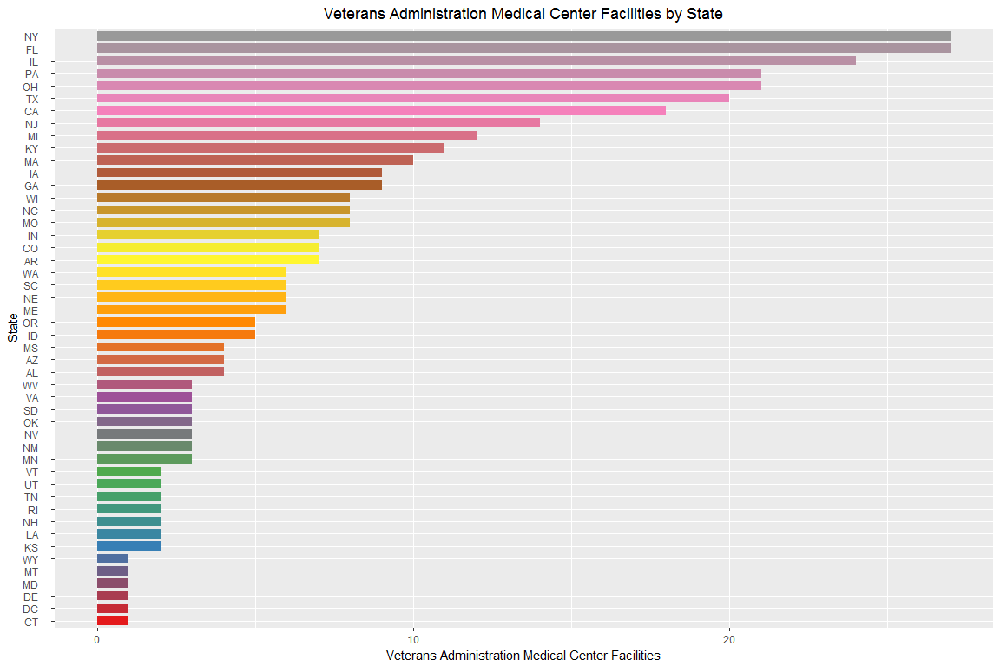
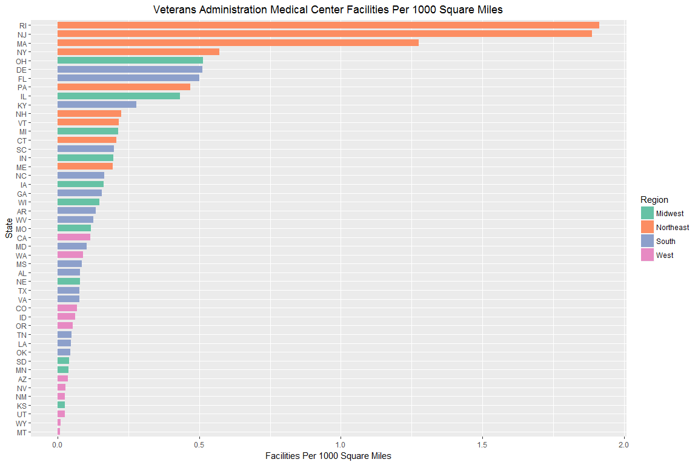

####GitHub Repository: https://github.com/lp5510/Homework/tree/master/LiveSession09

# Questions

#### Background: Your organization is responsible for building new VA hospitals in the mainland of the United States. You are a little overwhelmed by the prospect, not sure which places need the most help. You decide to begin by exploring healthcare facility data recorded by the U.S. Government.

#### Disclaimer: While these are real data, the assignment is not an endorsement for any particular position on medical affairs or building hospitals. It is for instructional use only.

###1. Mental Health Clinics 

####a. This data set is a survey of every known healthcare facility that offers mental health services in the United States in 2015. Navigate to https://datafiles.samhsa.gov/study-dataset/national-mental-health-services-survey-2015-n-mhss-2015-ds0001-nid17098 and select the R download. Look through the codebook PDF for an explanation on certain variables. Upon opening the RDA file, the data set should be inserted into your global environment, which you can then reference.


```r
# Load mh2015_puf environment from data directory
load("N-MHSS-2015-DS0001-data-r.rda")
```

####b. Please create code which lists the State abbreviations without their counts, one abbreviation per State value. It does not have to in data frame format. A vector is fine.


```r
# Pull out STATE abbreviations without count
state <- dplyr::select(mh2015_puf, LST)

# remove counts from df 
state <- state[-1, ] 

head(state)
```

```
## [1] AL     AL     AL     AL     AL     AL    
## 55 Levels: AK     AL     AR     AS     AZ     CA     CO     ... WY
```

####c. Filter the data.frame from 1A. We are only interested in the Veterans Administration (VA) medical centers in the mainland United States-create a listing of counts of these centers by state, including only mainland locations. Alaska, Hawaii, and U.S. territories should be omitted. DC, while not a state, is in the mainland, so it should remain included. Convert this to data.frame()


```r
# Filter for "FACILITYTYPE" for VAMC facilities by LST
data.frame <- dplyr::filter(mh2015_puf, FACILITYTYPE == "Veterans Administration medical center (VAMC) or other VA health care facility")
data.frame <- dplyr::select(data.frame, LST, FACILITYTYPE)
data.frame <- dplyr::arrange(data.frame, LST)

# Remove AK, HI and PR entries from LST
data.frame <- data.frame[-grep("AK", data.frame$LST),] 
data.frame <- data.frame[-grep("HI", data.frame$LST),]
data.frame <- data.frame[-grep("PR", data.frame$LST),]
```

####d. Create a ggplot barchart of this filtered data set. Vary the bar's colors by what State it has listed. Give it an appropriately professional title that is centered. Make sure you have informative axis labels. The State axis should be readable, not layered over each other. You're welcome to have a legend or not.


```r
# Output final state listing with frequency count
data.frame <- data.frame %>% group_by(FACILITYTYPE, LST) %>% tally()
data.frame$FACILITYTYPE = NULL

# Order barplot by decreasing frequency
data.frame$LST <- factor(data.frame$LST, levels = data.frame$LST[order(data.frame$n)])

# Define and expand color pallette to 48 colors
colourCount <- length(unique(data.frame$LST))  
getPalette <- colorRampPalette(brewer.pal(9, "Set1"))

# Plot VAMC facilities vs State with color 
p <- ggplot(data.frame, aes(x=as.factor(LST), y=n, fill=as.factor(LST), width=0.75)) + geom_bar(stat = "identity") 
p <- p + coord_flip() + guides(fill=FALSE) + xlab("State") + ylab("Veterans Administration Medical Center Facilities")
p <- p + ggtitle("Veterans Administration Medical Center Facilities by State") + theme(plot.title = element_text(hjust=0.5))
p <- p + scale_fill_manual(values = colorRampPalette(brewer.pal(9,"Set1"))(colourCount))
p
```

<!-- -->

###2. Cleaning and Bringing in New Features

####a. This graph (1D) might be somewhat misleading, as bigger states may have more hospitals, but could be more sparsely located. Read statesize.csv into your R environment. This contains essentially a vector of square miles for each state. In trying to merge it with your data.frame() from 1C, you find that they don't match. Use paste() on your LST column in 1C to see what the matter is, and write what you observe in a comment.


```r
# Read stateside.csv into R environment
statesize <- read.csv(file="statesize.csv", header=TRUE, sep=",")

# Rename Abbrev col to LST in statesize df
statesize <- dplyr::rename(statesize, LST = Abbrev)

# Remove AK and HI entries from LST 
statesize <- statesize[-grep("AK", statesize$LST),] 
statesize <- statesize[-grep("HI", statesize$LST),]

# Attempt merge
test <- dplyr::inner_join(statesize, data.frame, by = "LST")
summary(test)
```

```
##       StateName    SqMiles        LST                  Region 
##  Alabama   :0   Min.   : NA   Length:0           Midwest  :0  
##  Alaska    :0   1st Qu.: NA   Class :character   Northeast:0  
##  Arizona   :0   Median : NA   Mode  :character   South    :0  
##  Arkansas  :0   Mean   :NaN                      West     :0  
##  California:0   3rd Qu.: NA                                   
##  Colorado  :0   Max.   : NA                                   
##  (Other)   :0                                                 
##        n      
##  Min.   : NA  
##  1st Qu.: NA  
##  Median : NA  
##  Mean   :NaN  
##  3rd Qu.: NA  
##  Max.   : NA  
## 
```


#### Diagnose the LST variables in data.frame using the paste() command


```r
# Use paste()command to diagnose issue
paste(data.frame$LST)
```

```
##  [1] "AL    " "AR    " "AZ    " "CA    " "CO    " "CT    " "DC    "
##  [8] "DE    " "FL    " "GA    " "IA    " "ID    " "IL    " "IN    "
## [15] "KS    " "KY    " "LA    " "MA    " "MD    " "ME    " "MI    "
## [22] "MN    " "MO    " "MS    " "MT    " "NC    " "NE    " "NH    "
## [29] "NJ    " "NM    " "NV    " "NY    " "OH    " "OK    " "OR    "
## [36] "PA    " "RI    " "SC    " "SD    " "TN    " "TX    " "UT    "
## [43] "VA    " "VT    " "WA    " "WI    " "WV    " "WY    "
```

```r
# data.frame$LST has 3 extra spaces in character string, preventing a merge on the LST variable 
```

#### The variable data.frame has 3 whitespaces after each state abbreviation which is preventing a successful merge with the statesize data frame. 

####b. Correct the problem with the LST column using any method in R that is programmatic and easily understandable. Once you have made these state abbreviations identical to statesize.csv's Abbrev column, merge the data.frame() from 1C and statesize.csv in order to add size information. 

#### In this situation, the str_trim function within stringr was used to remove the whitespaces around the state variable in data.frame.  


```r
# Correct this problem using stringr "str_trim" option
data.frame$LST <- str_trim(data.frame$LST)
paste(data.frame$LST)
```

```
##  [1] "AL" "AR" "AZ" "CA" "CO" "CT" "DC" "DE" "FL" "GA" "IA" "ID" "IL" "IN"
## [15] "KS" "KY" "LA" "MA" "MD" "ME" "MI" "MN" "MO" "MS" "MT" "NC" "NE" "NH"
## [29] "NJ" "NM" "NV" "NY" "OH" "OK" "OR" "PA" "RI" "SC" "SD" "TN" "TX" "UT"
## [43] "VA" "VT" "WA" "WI" "WV" "WY"
```


```r
# Merge statesize and data.frame
data.frame <- dplyr::inner_join(statesize, data.frame, by = "LST")
summary(data.frame)
```

```
##        StateName     SqMiles           LST                  Region  
##  Alabama    : 1   Min.   :  1045   Length:47          Midwest  :11  
##  Arizona    : 1   1st Qu.: 37734   Class :character   Northeast: 9  
##  Arkansas   : 1   Median : 53997   Mode  :character   South    :16  
##  California : 1   Mean   : 61494                      West     :11  
##  Colorado   : 1   3rd Qu.: 80720                                    
##  Connecticut: 1   Max.   :261914                                    
##  (Other)    :41                                                     
##        n         
##  Min.   : 1.000  
##  1st Qu.: 2.500  
##  Median : 5.000  
##  Mean   : 7.532  
##  3rd Qu.: 9.000  
##  Max.   :27.000  
## 
```

####c. Calculate a new variable in your combined data.frame() which indicates the VA hospitals per thousand square miles.


```r
# Add new variable "VAHPerSqMi" for VA facilities per 1000 sq mile
data.frame$KSqMiles <- data.frame$SqMiles/1000
data.frame <- dplyr::mutate(data.frame, VAHPerKSqMi = n/KSqMiles)

# Clean up data frame
data.frame <- dplyr::select(data.frame, StateName, LST, n, Region, KSqMiles, VAHPerKSqMi)
data.frame <- dplyr::arrange(data.frame, desc(VAHPerKSqMi))

kable(data.frame, "html") %>%
  kable_styling(bootstrap_options = c("striped", "hover"))
```

<table class="table table-striped table-hover" style="margin-left: auto; margin-right: auto;">
 <thead>
  <tr>
   <th style="text-align:left;"> StateName </th>
   <th style="text-align:left;"> LST </th>
   <th style="text-align:right;"> n </th>
   <th style="text-align:left;"> Region </th>
   <th style="text-align:right;"> KSqMiles </th>
   <th style="text-align:right;"> VAHPerKSqMi </th>
  </tr>
 </thead>
<tbody>
  <tr>
   <td style="text-align:left;"> Rhode Island </td>
   <td style="text-align:left;"> RI </td>
   <td style="text-align:right;"> 2 </td>
   <td style="text-align:left;"> Northeast </td>
   <td style="text-align:right;"> 1.045 </td>
   <td style="text-align:right;"> 1.9138756 </td>
  </tr>
  <tr>
   <td style="text-align:left;"> New Jersey </td>
   <td style="text-align:left;"> NJ </td>
   <td style="text-align:right;"> 14 </td>
   <td style="text-align:left;"> Northeast </td>
   <td style="text-align:right;"> 7.419 </td>
   <td style="text-align:right;"> 1.8870468 </td>
  </tr>
  <tr>
   <td style="text-align:left;"> Massachusetts </td>
   <td style="text-align:left;"> MA </td>
   <td style="text-align:right;"> 10 </td>
   <td style="text-align:left;"> Northeast </td>
   <td style="text-align:right;"> 7.838 </td>
   <td style="text-align:right;"> 1.2758357 </td>
  </tr>
  <tr>
   <td style="text-align:left;"> New York </td>
   <td style="text-align:left;"> NY </td>
   <td style="text-align:right;"> 27 </td>
   <td style="text-align:left;"> Northeast </td>
   <td style="text-align:right;"> 47.224 </td>
   <td style="text-align:right;"> 0.5717432 </td>
  </tr>
  <tr>
   <td style="text-align:left;"> Ohio </td>
   <td style="text-align:left;"> OH </td>
   <td style="text-align:right;"> 21 </td>
   <td style="text-align:left;"> Midwest </td>
   <td style="text-align:right;"> 40.953 </td>
   <td style="text-align:right;"> 0.5127829 </td>
  </tr>
  <tr>
   <td style="text-align:left;"> Delaware </td>
   <td style="text-align:left;"> DE </td>
   <td style="text-align:right;"> 1 </td>
   <td style="text-align:left;"> South </td>
   <td style="text-align:right;"> 1.955 </td>
   <td style="text-align:right;"> 0.5115090 </td>
  </tr>
  <tr>
   <td style="text-align:left;"> Florida </td>
   <td style="text-align:left;"> FL </td>
   <td style="text-align:right;"> 27 </td>
   <td style="text-align:left;"> South </td>
   <td style="text-align:right;"> 53.997 </td>
   <td style="text-align:right;"> 0.5000278 </td>
  </tr>
  <tr>
   <td style="text-align:left;"> Pennsylvania </td>
   <td style="text-align:left;"> PA </td>
   <td style="text-align:right;"> 21 </td>
   <td style="text-align:left;"> Northeast </td>
   <td style="text-align:right;"> 44.820 </td>
   <td style="text-align:right;"> 0.4685408 </td>
  </tr>
  <tr>
   <td style="text-align:left;"> Illinois </td>
   <td style="text-align:left;"> IL </td>
   <td style="text-align:right;"> 24 </td>
   <td style="text-align:left;"> Midwest </td>
   <td style="text-align:right;"> 55.593 </td>
   <td style="text-align:right;"> 0.4317090 </td>
  </tr>
  <tr>
   <td style="text-align:left;"> Kentucky </td>
   <td style="text-align:left;"> KY </td>
   <td style="text-align:right;"> 11 </td>
   <td style="text-align:left;"> South </td>
   <td style="text-align:right;"> 39.732 </td>
   <td style="text-align:right;"> 0.2768549 </td>
  </tr>
  <tr>
   <td style="text-align:left;"> New Hampshire </td>
   <td style="text-align:left;"> NH </td>
   <td style="text-align:right;"> 2 </td>
   <td style="text-align:left;"> Northeast </td>
   <td style="text-align:right;"> 8.969 </td>
   <td style="text-align:right;"> 0.2229903 </td>
  </tr>
  <tr>
   <td style="text-align:left;"> Vermont </td>
   <td style="text-align:left;"> VT </td>
   <td style="text-align:right;"> 2 </td>
   <td style="text-align:left;"> Northeast </td>
   <td style="text-align:right;"> 9.249 </td>
   <td style="text-align:right;"> 0.2162396 </td>
  </tr>
  <tr>
   <td style="text-align:left;"> Michigan </td>
   <td style="text-align:left;"> MI </td>
   <td style="text-align:right;"> 12 </td>
   <td style="text-align:left;"> Midwest </td>
   <td style="text-align:right;"> 56.539 </td>
   <td style="text-align:right;"> 0.2122429 </td>
  </tr>
  <tr>
   <td style="text-align:left;"> Connecticut </td>
   <td style="text-align:left;"> CT </td>
   <td style="text-align:right;"> 1 </td>
   <td style="text-align:left;"> Northeast </td>
   <td style="text-align:right;"> 4.845 </td>
   <td style="text-align:right;"> 0.2063983 </td>
  </tr>
  <tr>
   <td style="text-align:left;"> South Carolina </td>
   <td style="text-align:left;"> SC </td>
   <td style="text-align:right;"> 6 </td>
   <td style="text-align:left;"> South </td>
   <td style="text-align:right;"> 30.111 </td>
   <td style="text-align:right;"> 0.1992627 </td>
  </tr>
  <tr>
   <td style="text-align:left;"> Indiana </td>
   <td style="text-align:left;"> IN </td>
   <td style="text-align:right;"> 7 </td>
   <td style="text-align:left;"> Midwest </td>
   <td style="text-align:right;"> 35.870 </td>
   <td style="text-align:right;"> 0.1951491 </td>
  </tr>
  <tr>
   <td style="text-align:left;"> Maine </td>
   <td style="text-align:left;"> ME </td>
   <td style="text-align:right;"> 6 </td>
   <td style="text-align:left;"> Northeast </td>
   <td style="text-align:right;"> 30.865 </td>
   <td style="text-align:right;"> 0.1943949 </td>
  </tr>
  <tr>
   <td style="text-align:left;"> North Carolina </td>
   <td style="text-align:left;"> NC </td>
   <td style="text-align:right;"> 8 </td>
   <td style="text-align:left;"> South </td>
   <td style="text-align:right;"> 48.718 </td>
   <td style="text-align:right;"> 0.1642104 </td>
  </tr>
  <tr>
   <td style="text-align:left;"> Iowa </td>
   <td style="text-align:left;"> IA </td>
   <td style="text-align:right;"> 9 </td>
   <td style="text-align:left;"> Midwest </td>
   <td style="text-align:right;"> 55.875 </td>
   <td style="text-align:right;"> 0.1610738 </td>
  </tr>
  <tr>
   <td style="text-align:left;"> Georgia </td>
   <td style="text-align:left;"> GA </td>
   <td style="text-align:right;"> 9 </td>
   <td style="text-align:left;"> South </td>
   <td style="text-align:right;"> 57.919 </td>
   <td style="text-align:right;"> 0.1553894 </td>
  </tr>
  <tr>
   <td style="text-align:left;"> Wisconsin </td>
   <td style="text-align:left;"> WI </td>
   <td style="text-align:right;"> 8 </td>
   <td style="text-align:left;"> Midwest </td>
   <td style="text-align:right;"> 54.314 </td>
   <td style="text-align:right;"> 0.1472917 </td>
  </tr>
  <tr>
   <td style="text-align:left;"> Arkansas </td>
   <td style="text-align:left;"> AR </td>
   <td style="text-align:right;"> 7 </td>
   <td style="text-align:left;"> South </td>
   <td style="text-align:right;"> 52.075 </td>
   <td style="text-align:right;"> 0.1344215 </td>
  </tr>
  <tr>
   <td style="text-align:left;"> West Virginia </td>
   <td style="text-align:left;"> WV </td>
   <td style="text-align:right;"> 3 </td>
   <td style="text-align:left;"> South </td>
   <td style="text-align:right;"> 24.087 </td>
   <td style="text-align:right;"> 0.1245485 </td>
  </tr>
  <tr>
   <td style="text-align:left;"> Missouri </td>
   <td style="text-align:left;"> MO </td>
   <td style="text-align:right;"> 8 </td>
   <td style="text-align:left;"> Midwest </td>
   <td style="text-align:right;"> 68.898 </td>
   <td style="text-align:right;"> 0.1161137 </td>
  </tr>
  <tr>
   <td style="text-align:left;"> California </td>
   <td style="text-align:left;"> CA </td>
   <td style="text-align:right;"> 18 </td>
   <td style="text-align:left;"> West </td>
   <td style="text-align:right;"> 155.973 </td>
   <td style="text-align:right;"> 0.1154046 </td>
  </tr>
  <tr>
   <td style="text-align:left;"> Maryland </td>
   <td style="text-align:left;"> MD </td>
   <td style="text-align:right;"> 1 </td>
   <td style="text-align:left;"> South </td>
   <td style="text-align:right;"> 9.775 </td>
   <td style="text-align:right;"> 0.1023018 </td>
  </tr>
  <tr>
   <td style="text-align:left;"> Washington </td>
   <td style="text-align:left;"> WA </td>
   <td style="text-align:right;"> 6 </td>
   <td style="text-align:left;"> West </td>
   <td style="text-align:right;"> 66.582 </td>
   <td style="text-align:right;"> 0.0901144 </td>
  </tr>
  <tr>
   <td style="text-align:left;"> Mississippi </td>
   <td style="text-align:left;"> MS </td>
   <td style="text-align:right;"> 4 </td>
   <td style="text-align:left;"> South </td>
   <td style="text-align:right;"> 46.914 </td>
   <td style="text-align:right;"> 0.0852624 </td>
  </tr>
  <tr>
   <td style="text-align:left;"> Alabama </td>
   <td style="text-align:left;"> AL </td>
   <td style="text-align:right;"> 4 </td>
   <td style="text-align:left;"> South </td>
   <td style="text-align:right;"> 50.750 </td>
   <td style="text-align:right;"> 0.0788177 </td>
  </tr>
  <tr>
   <td style="text-align:left;"> Nebraska </td>
   <td style="text-align:left;"> NE </td>
   <td style="text-align:right;"> 6 </td>
   <td style="text-align:left;"> Midwest </td>
   <td style="text-align:right;"> 76.878 </td>
   <td style="text-align:right;"> 0.0780457 </td>
  </tr>
  <tr>
   <td style="text-align:left;"> Texas </td>
   <td style="text-align:left;"> TX </td>
   <td style="text-align:right;"> 20 </td>
   <td style="text-align:left;"> South </td>
   <td style="text-align:right;"> 261.914 </td>
   <td style="text-align:right;"> 0.0763609 </td>
  </tr>
  <tr>
   <td style="text-align:left;"> Virginia </td>
   <td style="text-align:left;"> VA </td>
   <td style="text-align:right;"> 3 </td>
   <td style="text-align:left;"> South </td>
   <td style="text-align:right;"> 39.598 </td>
   <td style="text-align:right;"> 0.0757614 </td>
  </tr>
  <tr>
   <td style="text-align:left;"> Colorado </td>
   <td style="text-align:left;"> CO </td>
   <td style="text-align:right;"> 7 </td>
   <td style="text-align:left;"> West </td>
   <td style="text-align:right;"> 103.730 </td>
   <td style="text-align:right;"> 0.0674829 </td>
  </tr>
  <tr>
   <td style="text-align:left;"> Idaho </td>
   <td style="text-align:left;"> ID </td>
   <td style="text-align:right;"> 5 </td>
   <td style="text-align:left;"> West </td>
   <td style="text-align:right;"> 82.751 </td>
   <td style="text-align:right;"> 0.0604222 </td>
  </tr>
  <tr>
   <td style="text-align:left;"> Oregon </td>
   <td style="text-align:left;"> OR </td>
   <td style="text-align:right;"> 5 </td>
   <td style="text-align:left;"> West </td>
   <td style="text-align:right;"> 96.003 </td>
   <td style="text-align:right;"> 0.0520817 </td>
  </tr>
  <tr>
   <td style="text-align:left;"> Tennessee </td>
   <td style="text-align:left;"> TN </td>
   <td style="text-align:right;"> 2 </td>
   <td style="text-align:left;"> South </td>
   <td style="text-align:right;"> 41.220 </td>
   <td style="text-align:right;"> 0.0485201 </td>
  </tr>
  <tr>
   <td style="text-align:left;"> Louisiana </td>
   <td style="text-align:left;"> LA </td>
   <td style="text-align:right;"> 2 </td>
   <td style="text-align:left;"> South </td>
   <td style="text-align:right;"> 43.566 </td>
   <td style="text-align:right;"> 0.0459074 </td>
  </tr>
  <tr>
   <td style="text-align:left;"> Oklahoma </td>
   <td style="text-align:left;"> OK </td>
   <td style="text-align:right;"> 3 </td>
   <td style="text-align:left;"> South </td>
   <td style="text-align:right;"> 68.679 </td>
   <td style="text-align:right;"> 0.0436815 </td>
  </tr>
  <tr>
   <td style="text-align:left;"> South Dakota </td>
   <td style="text-align:left;"> SD </td>
   <td style="text-align:right;"> 3 </td>
   <td style="text-align:left;"> Midwest </td>
   <td style="text-align:right;"> 75.898 </td>
   <td style="text-align:right;"> 0.0395267 </td>
  </tr>
  <tr>
   <td style="text-align:left;"> Minnesota </td>
   <td style="text-align:left;"> MN </td>
   <td style="text-align:right;"> 3 </td>
   <td style="text-align:left;"> Midwest </td>
   <td style="text-align:right;"> 79.617 </td>
   <td style="text-align:right;"> 0.0376804 </td>
  </tr>
  <tr>
   <td style="text-align:left;"> Arizona </td>
   <td style="text-align:left;"> AZ </td>
   <td style="text-align:right;"> 4 </td>
   <td style="text-align:left;"> West </td>
   <td style="text-align:right;"> 113.642 </td>
   <td style="text-align:right;"> 0.0351983 </td>
  </tr>
  <tr>
   <td style="text-align:left;"> Nevada </td>
   <td style="text-align:left;"> NV </td>
   <td style="text-align:right;"> 3 </td>
   <td style="text-align:left;"> West </td>
   <td style="text-align:right;"> 109.806 </td>
   <td style="text-align:right;"> 0.0273209 </td>
  </tr>
  <tr>
   <td style="text-align:left;"> New Mexico </td>
   <td style="text-align:left;"> NM </td>
   <td style="text-align:right;"> 3 </td>
   <td style="text-align:left;"> West </td>
   <td style="text-align:right;"> 121.365 </td>
   <td style="text-align:right;"> 0.0247188 </td>
  </tr>
  <tr>
   <td style="text-align:left;"> Kansas </td>
   <td style="text-align:left;"> KS </td>
   <td style="text-align:right;"> 2 </td>
   <td style="text-align:left;"> Midwest </td>
   <td style="text-align:right;"> 81.823 </td>
   <td style="text-align:right;"> 0.0244430 </td>
  </tr>
  <tr>
   <td style="text-align:left;"> Utah </td>
   <td style="text-align:left;"> UT </td>
   <td style="text-align:right;"> 2 </td>
   <td style="text-align:left;"> West </td>
   <td style="text-align:right;"> 82.168 </td>
   <td style="text-align:right;"> 0.0243404 </td>
  </tr>
  <tr>
   <td style="text-align:left;"> Wyoming </td>
   <td style="text-align:left;"> WY </td>
   <td style="text-align:right;"> 1 </td>
   <td style="text-align:left;"> West </td>
   <td style="text-align:right;"> 97.105 </td>
   <td style="text-align:right;"> 0.0102981 </td>
  </tr>
  <tr>
   <td style="text-align:left;"> Montana </td>
   <td style="text-align:left;"> MT </td>
   <td style="text-align:right;"> 1 </td>
   <td style="text-align:left;"> West </td>
   <td style="text-align:right;"> 145.556 </td>
   <td style="text-align:right;"> 0.0068702 </td>
  </tr>
</tbody>
</table>

####d. Create another ggplot which considers the VAs per square thousand miles, rather than just frequency.
#####+Make sure the State axis is readable, like before. Change the title and axes as appropriate.
#####+Modify the ggplot syntax to make your bars in descending order (there are StackOverflow topics for this, and I have demonstrated how in Live Coding in prior classes).
#####+Color-code the bars based on Region (see the merged data.frame)-however, change the color scheme from the default. Any set of colors is fine, so long as it is readable.
#####+Keep the legend-you should have four regions and therefore four colors.


```r
# Order barplot by decreasing frequency
data.frame$LST <- factor(data.frame$LST, levels = data.frame$LST[order(data.frame$VAHPerKSqMi)])

# Plot VAMC facilities vs State with color 
p <- ggplot(data.frame, aes(x=as.factor(LST), y=VAHPerKSqMi, fill=as.factor(Region), width=0.75)) + geom_bar(stat = "identity") 
p <- p + coord_flip() + xlab("State") + ylab("Facilities Per 1000 Square Miles")
p <- p + ggtitle("Veterans Administration Medical Center Facilities Per 1000 Square Miles") + theme(plot.title = element_text(hjust=0.5))
p <- p + scale_fill_brewer(palette = "Set2")
p <- p + guides(fill=guide_legend(title="Region"))
p
```

<!-- -->


####e. What patterns do you see? By this metric, is there any region that seems relatively high for VA medical centers per thousand square miles? How about low? Given these data, what advice might you give your boss before you start modeling (and why)?

##### There is a noticably higher percentage of VA medical centers in the Northeastern US, while there is a faily sparse density in the South and West, suggesting a sizable disparity in the distribution of these facilities. It is apparent that the need for facilities is also driven by population of each region and the states and cities in those regions which is not addressed here. Population density would be a crucial factor in optimizing the location of additional facilities since larger population centers would likely experience higher demand for medical services.


